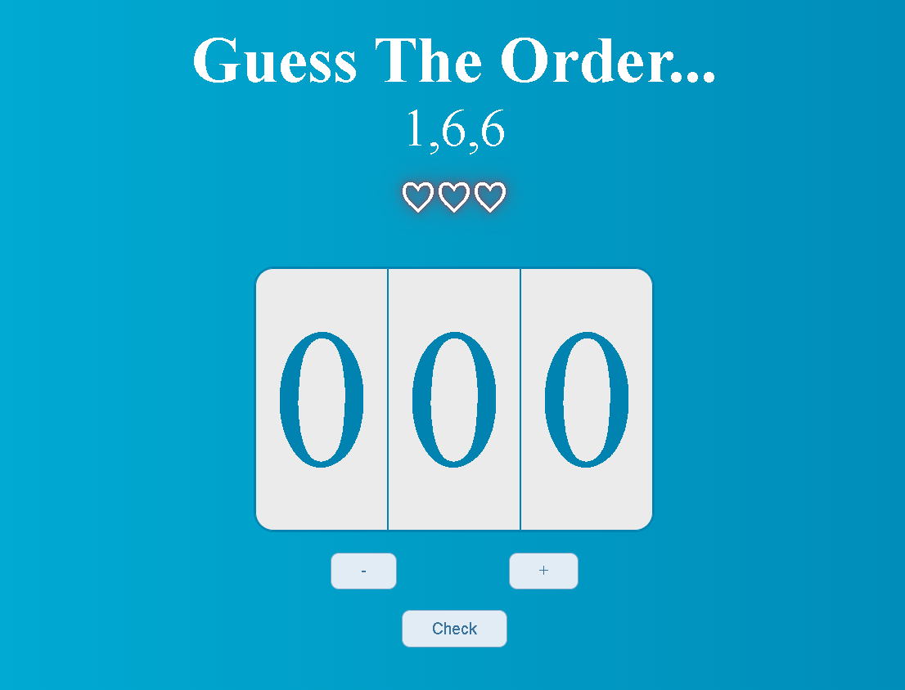

# Guess The Order...

---

## 

**Guess The Order** is a JS projet created as part of the JavaScript-Basics exam.

The main objective was to implement a counter using JavaScript to create the counter and the buttons.

---

### Technologies Used

**HTML**: Used for structuring the content and creating the basic layout of the project.

**CSS**: Employed for styling the HTML elements and enhancing the overall visual appeal.

**JavaScript**: The main programming language used to implement both the counter and the guessing game functionality.

---

## How to Play

1. **Initial Setup**:

   - Three counters start at zero.

   - Three numbers are displayed at the center of the screen in a random order.

2. **Guess the Order**:

   - Your goal is to correctly guess the order of the three numbers.

3. **Make Your Guess**:

   - Input your guess by adjusting the counters to your chosen values.
   - Submit your guess to see if you've got the right combination.

4. **Winning and Losing**:

   - If your guess is correct, congratulations! You win the game.
   - If your guess is incorrect, you lose a life (maximum of 3 lives).
